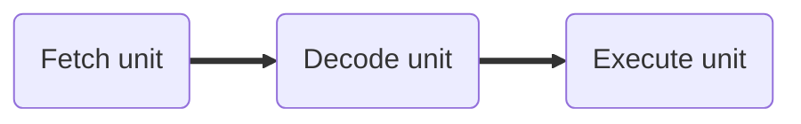
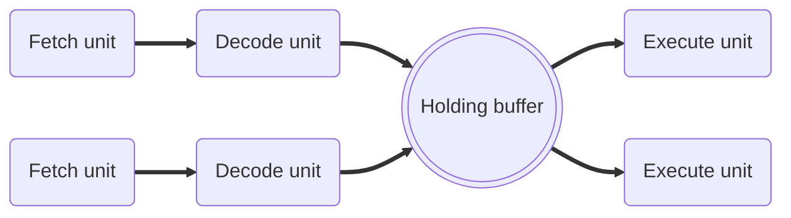

Does math and logic. Stores values in [[Registers|registers]].
# Basic cycles
- **Fetch Instruction** - read next expected instruction into buffer
- **Decode Instruction** - determine opcode operand specifiers
- **Calculate Operands** - calculate the effective address of each source operand
- **Fetch Operands** - fetch each operand from memory. Operands in registers need not be fetched
- **Execute Instruction** - perform the indicated operation and store the result
## Pipelines
### Three-stage pipeline

### Superscalar CPU

